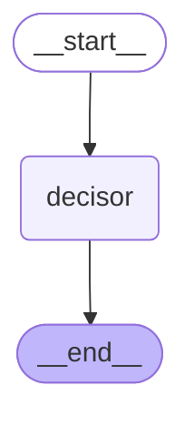
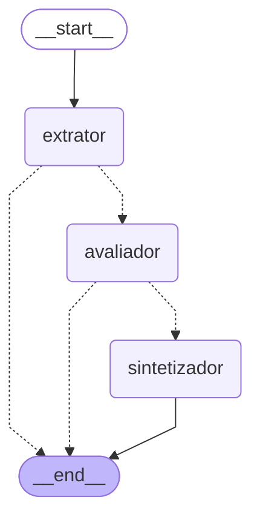
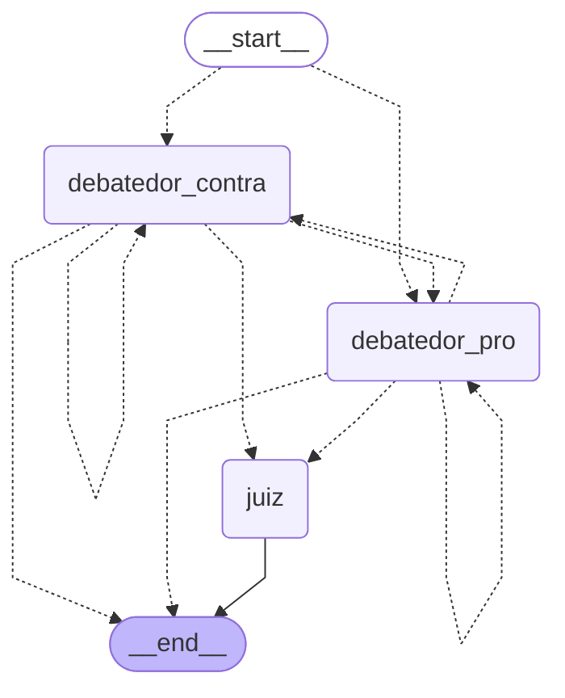
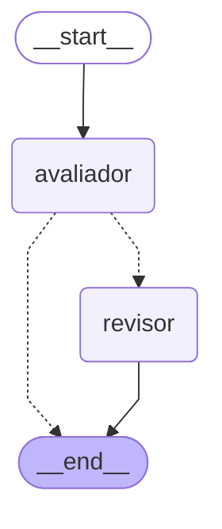
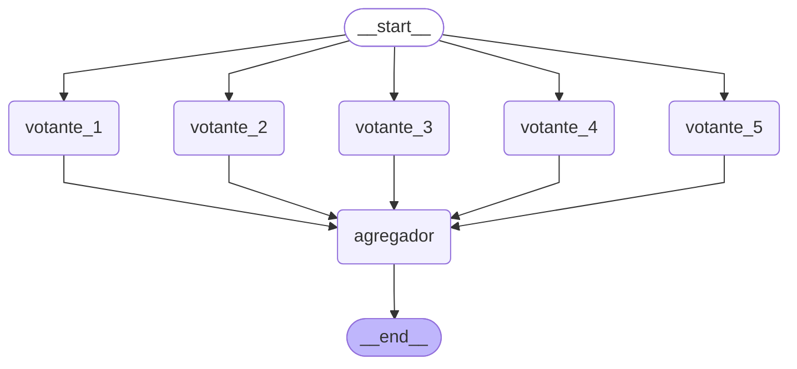

## agente_unico

```mermaid
---
config:
  flowchart:
    curve: linear
---
graph TD;
	__start__([<p>__start__</p>]):::first
	decisor(decisor)
	__end__([<p>__end__</p>]):::last
	__start__ --> decisor;
	decisor --> __end__;
	classDef default fill:#f2f0ff,line-height:1.2
	classDef first fill-opacity:0
	classDef last fill:#bfb6fc

```

## pipeline

```mermaid
---
config:
  flowchart:
    curve: linear
---
graph TD;
	__start__([<p>__start__</p>]):::first
	extrator(extrator)
	avaliador(avaliador)
	sintetizador(sintetizador)
	__end__([<p>__end__</p>]):::last
	__start__ --> extrator;
	avaliador -.-> __end__;
	avaliador -.-> sintetizador;
	extrator -.-> __end__;
	extrator -.-> avaliador;
	sintetizador --> __end__;
	classDef default fill:#f2f0ff,line-height:1.2
	classDef first fill-opacity:0
	classDef last fill:#bfb6fc

```

## debate

```mermaid
---
config:
  flowchart:
    curve: linear
---
graph TD;
	__start__([<p>__start__</p>]):::first
	debatedor_pro(debatedor_pro)
	debatedor_contra(debatedor_contra)
	juiz(juiz)
	__end__([<p>__end__</p>]):::last
	__start__ -.-> debatedor_contra;
	__start__ -.-> debatedor_pro;
	debatedor_contra -.-> __end__;
	debatedor_contra -.-> debatedor_pro;
	debatedor_contra -.-> juiz;
	debatedor_pro -.-> __end__;
	debatedor_pro -.-> debatedor_contra;
	debatedor_pro -.-> juiz;
	juiz --> __end__;
	debatedor_contra -.-> debatedor_contra;
	debatedor_pro -.-> debatedor_pro;
	classDef default fill:#f2f0ff,line-height:1.2
	classDef first fill-opacity:0
	classDef last fill:#bfb6fc

```

## revisao

```mermaid
---
config:
  flowchart:
    curve: linear
---
graph TD;
	__start__([<p>__start__</p>]):::first
	avaliador(avaliador)
	revisor(revisor)
	__end__([<p>__end__</p>]):::last
	__start__ --> avaliador;
	avaliador -.-> __end__;
	avaliador -.-> revisor;
	revisor --> __end__;
	classDef default fill:#f2f0ff,line-height:1.2
	classDef first fill-opacity:0
	classDef last fill:#bfb6fc

```

## ensemble

```mermaid
---
config:
  flowchart:
    curve: linear
---
graph TD;
	__start__([<p>__start__</p>]):::first
	votante_1(votante_1)
	votante_2(votante_2)
	votante_3(votante_3)
	votante_4(votante_4)
	votante_5(votante_5)
	agregador(agregador)
	__end__([<p>__end__</p>]):::last
	__start__ --> votante_1;
	__start__ --> votante_2;
	__start__ --> votante_3;
	__start__ --> votante_4;
	__start__ --> votante_5;
	votante_1 --> agregador;
	votante_2 --> agregador;
	votante_3 --> agregador;
	votante_4 --> agregador;
	votante_5 --> agregador;
	agregador --> __end__;
	classDef default fill:#f2f0ff,line-height:1.2
	classDef first fill-opacity:0
	classDef last fill:#bfb6fc

```

